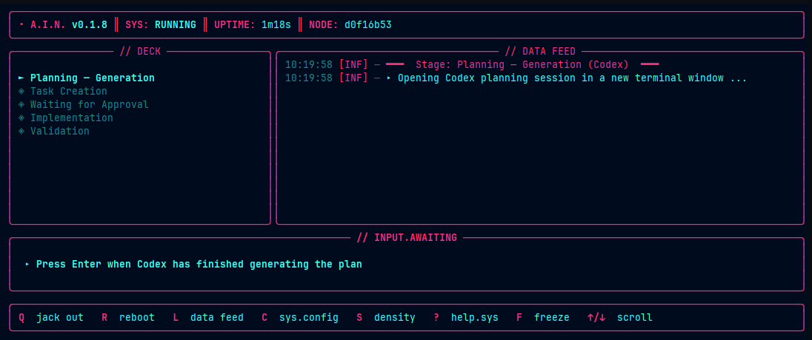

# A.I.N. Pipeline

A local multi-agent orchestrator for structured, reproducible AI-assisted development.

It coordinates architecture, planning, task generation, implementation, and validation through deterministic stages, with a required approval gate before implementation.



---

## Installation

```bash
pip install ain-pipeline
```

This installs the `ain` CLI.

---

## Quickstart

```bash
# 1) Enter your repository
cd your-project

# 2) Start the pipeline
ain run

# 3) Review status/health at any time
ain status

# 4) Approve when the run is waiting for approval
ain approve
```

---

## Pipeline Stages

The pipeline runs these stages in order:

```text
idle
scanning
architecture
user_context
planning_questions
planning_generation
task_creation
waiting_approval
implementation
validation
done
```

You can resume from a stage:

```bash
ain run --resume planning_generation
```

---

## CLI Reference

### Commands

| Command | Description |
|---|---|
| `ain run` | Run the pipeline from the current stage |
| `ain approve [--run-id ID]` | Approve a run that is waiting for approval |
| `ain status [--json]` | Show pipeline state + health summary |
| `ain reset [--hard] [--yes]` | Reset state (soft by default) |
| `ain logs [--follow] [--tail N] [--level L] [--source S] [--json]` | View merged logs |
| `ain config list` | List managed config keys and origin |
| `ain config get <key>` | Show effective config value |
| `ain config set <key> <value>` | Set project config value |
| `ain config reset [key]` | Reset one or all managed keys |
| `ain version [--short]` | Show version (and commit when available) |

### `ain run` options

| Option | Description |
|---|---|
| `--plain` | Force plain output |
| `--tui rich|textual` | Request renderer (`textual` currently falls back to Rich) |
| `--no-color` | Set `NO_COLOR=1` |
| `--resume <stage>` | Resume from a stage |
| `--health-check-only` | Run health checks and exit (no pipeline execution) |
| `--no-cache` | Set `AIN_NO_CACHE=1` for this run |

### Deprecated legacy flags (still accepted)

| Old | New |
|---|---|
| `ain --status` | `ain status` |
| `ain --approve` | `ain approve` |
| `ain --reset` | `ain reset` |

These print a deprecation warning and are planned for removal in `v2.0.0`.

---

## Health Checks and Status

`ain status` reports:
- Pipeline state from `.ai-pipeline/state.json`
- Environment health summary (binaries, config files, state files)

Exit code behavior:
- `0` when health is `healthy`
- `1` when health is `degraded` or `unhealthy`

Machine-readable output:

```bash
ain status --json
```

Health-only run (without executing stages):

```bash
ain run --health-check-only
```

---

## Configuration

Configuration merge order:

```text
ain/data/config.json  <  ~/.ainrc  <  .ai-pipeline/config.json
```

### Runtime controls

Default config now includes runtime controls:

- `runtime.timeouts.default_seconds`
- `runtime.timeouts.per_stage.<stage>`
- `runtime.retries.max_attempts`
- `runtime.retries.backoff_seconds`
- `runtime.retries.backoff_multiplier`
- `runtime.retries.jitter`
- `runtime.retries.fail_fast.on_missing_binary`
- `runtime.retries.fail_fast.on_timeout`
- `runtime.retries.fail_fast.on_corrupted_state`
- `runtime.cache.enabled`
- `runtime.cache.path`
- `runtime.cache.ttl_seconds`
- `runtime.cache.max_entries`
- `runtime.cache.respect_cli_no_cache`

### Managed keys for `ain config`

The `ain config` subcommands currently manage these keys:

- `ui.renderer`
- `ui.no_color`
- `ui.first_run`
- `logs.default_tail`
- `logs.default_level`
- `logs.default_sources`
- `compat.deprecation_warnings`

Examples:

```bash
ain config list
ain config get ui.renderer
ain config set ui.no_color true
ain config reset ui.no_color
```

---

## State and Recovery

State is stored in `.ai-pipeline/state.json` (schema version `2`).

Behavior:
- Missing state file: a default state is created.
- Corrupt/invalid state file: the file is backed up as `state.json.bak-<timestamp>`, then reset.
- A repair record is stored in `last_error` with code `STATE_CORRUPT`.

Stage timing metrics are persisted to `.ai-pipeline/timings.json`.

---

## Logging

`ain logs` merges and filters:

- `.ai-pipeline/logs/pipeline.log`
- `.ai-pipeline/logs/validation.log`
- `.ai-pipeline/logs/agents/*.log`

Filter options:
- levels: `debug`, `info`, `warn`, `error`
- sources: `pipeline`, `validation`, `agent`

Examples:

```bash
ain logs --tail 100
ain logs --source agent --level warn
ain logs --follow
ain logs --json
```

---

## Repository Output

Typical generated files:

```text
docs/
  architecture.md
  OPEN_QUESTIONS.md
  PRD.md
  DESIGN.md
  FEATURE_SPEC.md
  TASKS.md
  TASK_GRAPH.json
  IMPLEMENTATION_LOG.md

.ai-pipeline/
  config.json
  state.json
  timings.json
  user_context.md
  brainstorm_context.md
  prompts/
  approvals/
  logs/
    pipeline.log
    validation.log
    agents/*.log
```

---

## Troubleshooting

Pipeline failed or paused:

```bash
ain status
ain run --resume <stage>
```

Need to clear progress only:

```bash
ain reset
```

Need to remove state and logs:

```bash
ain reset --hard --yes
```

Missing agent binary:
- Install the required CLI.
- Confirm it is on `PATH`.
- Re-run `ain status` or `ain run --health-check-only`.
